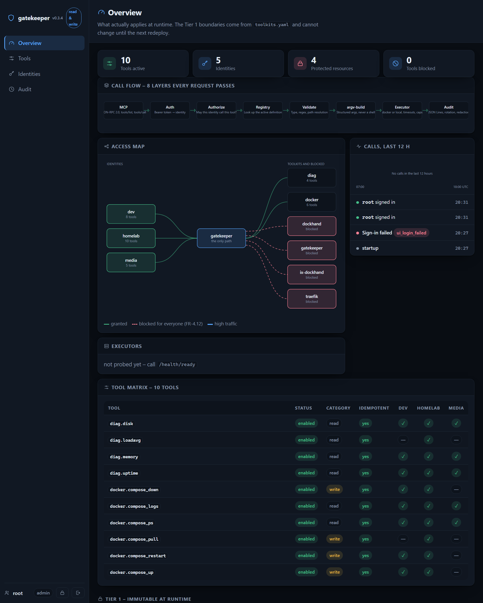
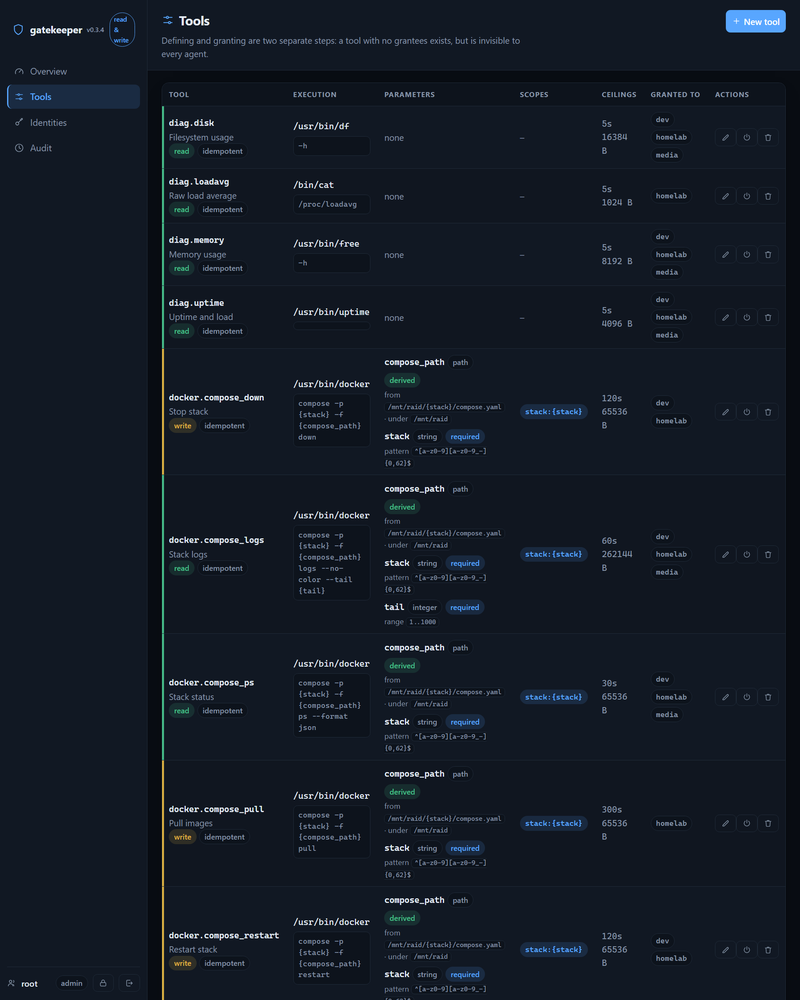
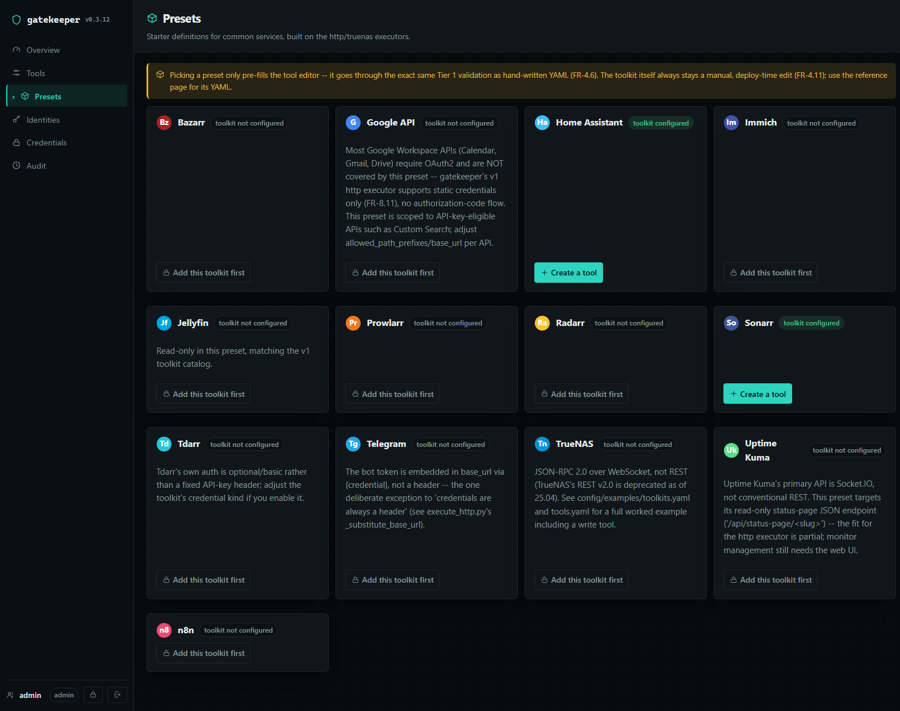
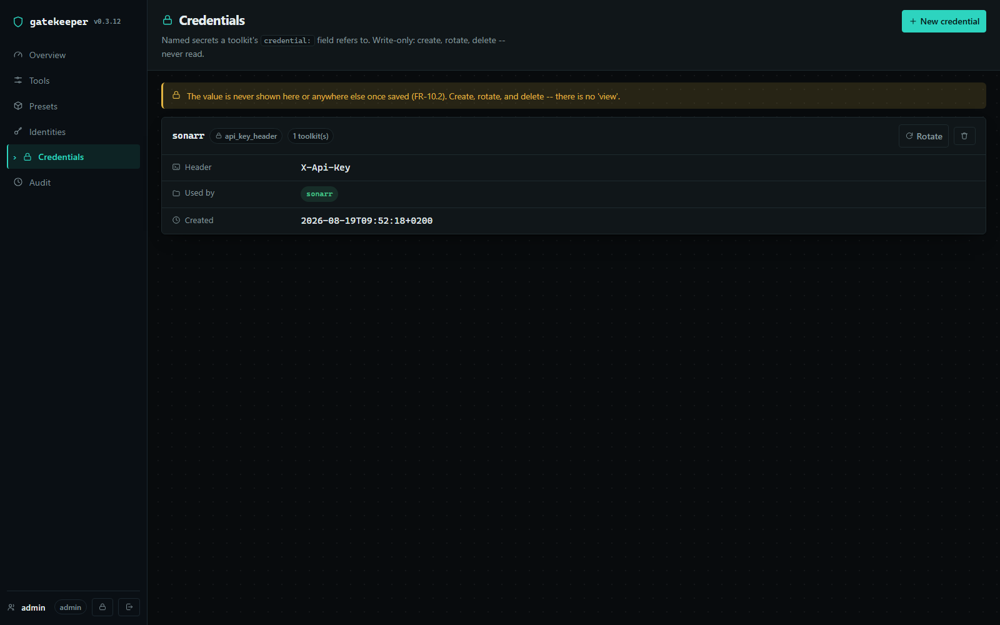
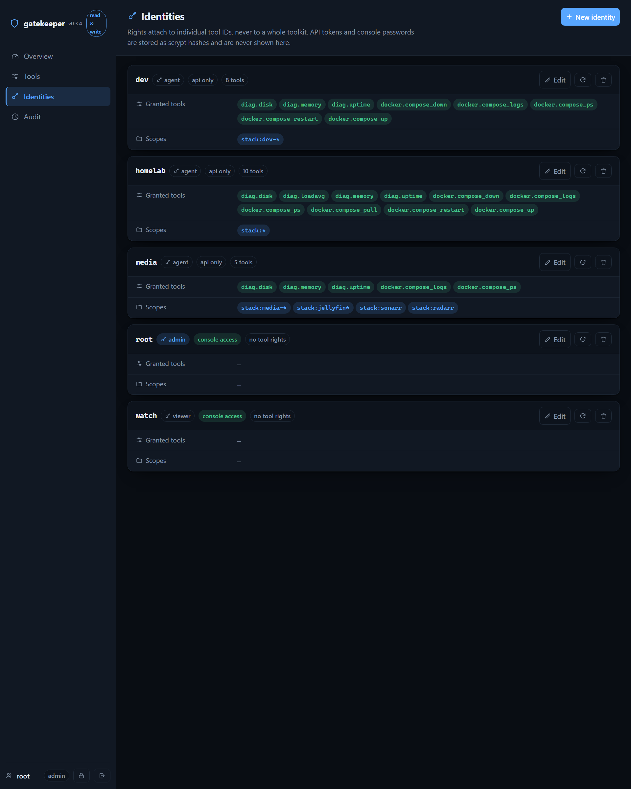
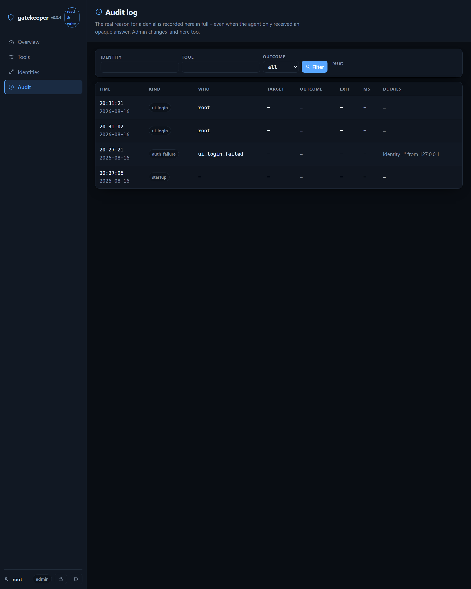

# gatekeeper

**A controlled MCP server for host operations.** Agents get a curated set of safe, audited actions instead of a shell. Each tool has its own token, granular permissions, and full audit trail.

→ [Full requirements](REQUIREMENTS.md) | [Architecture](docs/ARCHITECTURE.md) | [Deployment](docs/DEPLOYMENT.md) | [Roadmap](docs/ROADMAP.md) | [For agents](AGENTS.md) | [Release notes](RELEASE.md)

---

## What it does

Imagine you want an AI agent to safely operate Docker stacks on your homelab. Giving it shell access is too risky. gatekeeper sits in the middle:

- **Agent requests** `docker.compose_up` for a specific stack
- **gatekeeper checks**: Does this agent have permission? Is the stack name valid? Is the resource protected?
- **gatekeeper executes** the exact command, never a shell
- **Everything is logged** with who did what, when, and why

No shell injection. No command confusion. No hidden side effects.

### Key guarantees

- **No shell interpreter** — only safe argv-based execution
- **Two-tier config** — deploy-time safety (Tier 1) + runtime flexibility (Tier 2)
- **Granular permissions** — per-tool, per-identity, scoped by resource
- **Complete audit trail** — every call logged, even the rejected ones
- **Empty on install** — nothing ships preconfigured; every capability is an audited decision
- **Not just local commands** — `http` and `truenas` executors reach outside APIs the
  same way, with SSRF-safe target checks and secrets kept in a write-only credential
  store; see [Presets](#presets-add-sonarr-home-assistant-and-11-others-without-writing-yaml) below

---

## Quick start

```bash
# Development
python -m venv .venv && .venv/bin/pip install -e ".[dev]"
.venv/bin/python -m pytest -q

# Validate config without starting
gatekeeper --toolkits config/toolkits.yaml --tools config/tools.yaml \
  --identities config/identities.yaml check
```

---

## The console UI

Once started with `--ui`, gatekeeper hosts an admin dashboard at `/ui` where you:

- **View access** — who can call what, which resources are protected
- **Manage tools** — add, edit, enable/disable without restarting
- **Grant permissions** — link identities to tools with scopes
- **Monitor audit log** — search activity, track denials, find mistakes
- **Change passwords** — rotate console access for people

### Overview: At a glance



**Left column:** navigation. **Top row:** counts. **Access map:** which identities reach which toolkits (green=granted, red-dashed=protected). **Call flow:** the 8 layers every request passes. **Call history:** recent activity. **Tool matrix:** what's defined, what's active.

### Tools: Manage the catalog



Each tool is a template — a fixed action, not a free-form command. For a local binary that's a program path, arguments, and parameter rules; for an HTTP service (see Presets below) it's a method and path instead, shown as `REQUEST` on the card. Either way the editor shows the Tier 1 limits it has to stay inside, so you know what's allowed before you save. Defining and granting are two steps — a tool with no grantees exists but is invisible to every agent.

### Presets: add Sonarr, Home Assistant, and 11 others without writing YAML



Reaching an outside service (Sonarr, Radarr, Home Assistant, n8n, TrueNAS, …) used to mean nothing — gatekeeper could only run local commands and Docker. Now it has an `http` executor and a `truenas` executor, and a library of starter presets for 13 common homelab/SaaS services so you don't have to write the request shapes by hand:

```
 1. Pick a card                2. Paste its YAML once           3. Create a tool
 ┌─────────────┐               (deploy-time, one-time)          ┌─────────────┐
 │  So Sonarr   │  ───────►    toolkits.yaml + redeploy  ──────►│ ✓ list_series │
 └─────────────┘               (never done by the console)      └─────────────┘
```

The toolkit itself (which host, which address range, which credential) is still a
deploy-time decision you paste into `toolkits.yaml` by hand and redeploy — the
console can create *tools*, never *toolkits*, on purpose (that boundary is what
keeps a compromised admin session from reaching an address nobody approved).
Once a toolkit exists, picking one of its starter tools drops you straight into
the same editor as above, pre-filled instead of blank — still checked against
the same limits before it's saved.

### Credentials: store a secret without ever showing it again



Sonarr's API key, a Home Assistant token, TrueNAS's key — each gets a name here, encrypted at rest. After it's saved there is no "view" button anywhere, for any role: create, rotate, and delete are the only three things you can do with it. gatekeeper injects it into the request itself when a tool calls out; it never comes back through the console, the audit log, or a tool's response.

### Identities: Manage access



Create agents, viewers, admins. Each gets a token (for `/mcp`) and/or password (for `/ui`). Grant per-tool access with scopes. Change passwords on `/ui/account`. Rotate tokens to force reconnection.

### Audit log: Search activity



Every call logged—granted and denied. Real denial reasons stored, opaque message sent to agent. Search by identity, tool, timestamp. Export for compliance.

---

## Deployment

### 1. Choose storage

```bash
# On TrueNAS/ZFS
zfs create <pool>/raid/gatekeeper
```

### 2. Set up directories

```bash
mkdir -p /mnt/raid/gatekeeper/config /mnt/raid/gatekeeper/logs
chown -R 568:568 /mnt/raid/gatekeeper
```

### 3. Start (first time auto-configures)

```bash
docker compose up -d
docker compose logs gatekeeper | grep 'Administrator'
```

Output shows the admin password and API token—**shown once only**. After login, change password under `/ui/account`.

Config files created:
- `toolkits.yaml` (Tier 1: deploy-time, immutable) — empty, add your clusters
- `tools.yaml` (Tier 2: runtime, changes via UI) — empty, build from examples
- `identities.yaml` (Tier 2: runtime) — one admin account

### 4. Add permissions (Tier 1)

Edit `toolkits.yaml` — this is deploy-time config. Example for Docker:

```yaml
toolkits:
  docker:
    executor: docker
    binaries:
      - /usr/bin/docker
    denied_args: [rm, kill, exec, build, push, login, system, prune, cp, --privileged, -v, --volumes, --rmi]
    path_roots:
      - /mnt/raid
    protected_resources: [gatekeeper, dockhand, traefik]  # these cannot be touched
    max_timeout_seconds: 300
    max_output_bytes: 262144
```

See [toolkits example](config/examples/toolkits.yaml) for full reference.

### 5. Create tools and grant access

Use the `/ui` console (logged in as admin) or copy from [tools example](config/examples/tools.yaml).

Example tool:

```yaml
- id: docker.compose_ps
  toolkit: docker
  binary: /usr/bin/docker
  category: read
  idempotent: true
  enabled: true
  argv: ["compose", "-p", "{stack}", "-f", "{compose_path}", "ps", "--format", "json"]
  parameters:
    stack:
      type: string
      required: true
      pattern: "^[a-z0-9][a-z0-9_-]{0,62}$"
    compose_path:
      type: path
      derived: "/mnt/raid/{stack}/compose.yaml"
      must_resolve_under: /mnt/raid
  required_scopes: ["stack:{stack}"]
  timeout_seconds: 30
  max_output_bytes: 65536
```

Then grant access: go to **Identities**, pick an agent, add `docker.compose_ps` with scope `stack:*` or `stack:media-*`.

### 6. Connect an agent

In the agent's MCP config:

```yaml
mcp_servers:
  gatekeeper:
    transport: streamable_http
    url: http://<host>:8080/mcp
    headers:
      Authorization: "Bearer gk_..."
```

The agent now sees only tools it has permission for.

---

## Authentication: Two systems

### Console (human, `/ui`)

- **Who**: viewers and admins
- **Credential**: password (console login only)
- **Session**: separate cookie-based session
- **Change it**: `/ui/account` (requires old password)

### API (agent, `/mcp`)

- **Who**: agents, viewers, admins
- **Credential**: token (in `Authorization: Bearer` header)
- **Session**: stateless, token-based
- **Rotate it**: `/ui` under Identities (for admins/viewers) or via CLI for new tokens

These are intentionally separate. A leaked console password doesn't open `/mcp`. A leaked token doesn't open the dashboard.

---

## What admins can do

From the `/ui` console (when logged in):

- **Add/edit/disable/delete tools** — modify Tier 2 (runtime)
- **Create/edit/delete identities** — manage users and agents
- **Grant/revoke tool access** — assign permissions and scopes
- **Change passwords and rotate tokens** — via Identities view or personal account
- **View audit log** — search, filter, export

### What they can't do (by design)

- **Edit Tier 1** — no route to write `toolkits.yaml`. Binary allowlist, denied args, path roots, protected resources are deploy-time only. This is intentional: Tier 1 is the outer boundary that makes tool creation safe.
- **Bypass the sandbox** — every tool definition runs through the same Tier 1 validation as startup loading. A malformed tool is rejected, not loosened.
- **Hide actions** — everything goes to the audit log with the admin's identity. Deletions record the full definition so they're recoverable.

### Protections

- **Last admin protected** — can't delete or demote the last admin with a console password
- **CSRF token on writes** — every form includes a session-scoped token
- **Optimistic locking** — forms know the file revision; concurrent edits are detected and rejected
- **Atomic writes** — temp file + fsync + atomic rename; crashes leave the old file intact
- **After write, re-read** — the UI doesn't assume the write succeeded; it reloads from disk

---

## Audit & visibility

### Call flow (8 layers every request passes)

Each request passes through 8 validation stages:

1. **MCP protocol** — JSON-RPC 2.0 via Streamable HTTP
2. **Auth** — Bearer token verification
3. **Authorize** — does this identity have permission?
4. **Registry** — is the tool known?
5. **Validate** — are the parameters OK?
6. **Build the request** — substitute parameters into argv / an HTTP
   request / a JSON-RPC call (whichever the toolkit's executor uses), and
   check the result against denied args / target allowlist / RPC whitelist
7. **Execute** — run the process or call, enforce timeout & output limits
8. **Audit** — log the result

Any layer can deny; all denials look the same to the agent ("Unknown tool, or not available"). The audit log knows the real reason.

### Audit log format

JSON Lines, one entry per call:

```json
{"timestamp":"2026-08-16T12:39:48Z","identity":"homelab","tool":"diag.uptime","status":"ok","exit":0,...}
```

Stored in `audit.dir` from `toolkits.yaml`. Automatically rotated (default: 10 files × 32MB each). Search from `/ui/audit` with filters.

---

## Security notes

- **The Docker socket is root-equivalent on the host.** A bug here is a host compromise. That's why the config is two-tier (outer safety boundary) and the negative corpus of attack tests is kept.
- **Container logs can leak secrets gatekeeper doesn't manage.** Agents with `docker.compose_logs` see that container's own environment variables verbatim — gatekeeper only knows to redact secrets it holds itself. Anything created through the credential store (Credentials page) *is* masked out of tool output and the audit log wherever it appears (FR-10.6); an arbitrary secret baked into a container's env is not, because gatekeeper has no way to know it's one.
- **Admin access is powerful.** An admin can create any tool within Tier 1 bounds, grant it to agents, and they'll run. Treat console password like a host SSH key: one per person, changed regularly, `viewer` role for observers.
- **No shell history in passwords.** Always use `gatekeeper password --identity <id>` without `--password <value>` to avoid the password landing in shell history.
- **TLS required for `/ui`.** Console cookies run without `Secure` flag over HTTP. Deploy behind a reverse proxy with HTTPS, or on a private network only.

---

## Development & contribution

See [docs/ARCHITECTURE.md](docs/ARCHITECTURE.md) for:
- Code structure and invariants
- The two-tier security model, executors, and credential store
- Security-critical modules and the UI architecture

See [REQUIREMENTS.md](REQUIREMENTS.md) for:
- Complete feature list
- Functional and non-functional requirements
- Specification of each guarantee

See [AGENTS.md](AGENTS.md) if you're an AI agent working in this repo — release
workflow, testing, and known pitfalls.

---

## What's not here (yet)

See [docs/ROADMAP.md](docs/ROADMAP.md) for the full list with rationale.
Short version: no OAuth2 (static credentials only), no `ssh` executor, no
TrueNAS SCRAM mutual auth.

---

## License & attribution

Built for a homelab. Designed to be paranoid about safety. Used in production.
