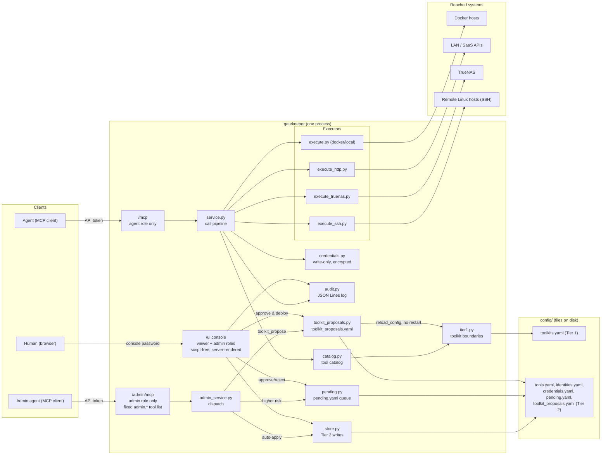
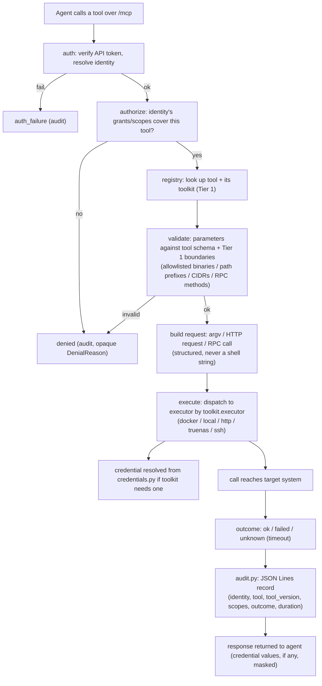

# Diagrams

Visual companion to [ARCHITECTURE.md](ARCHITECTURE.md).

## System architecture



## Call pipeline (one `/mcp` tool call)



## Tier 2 change approval (admin agent -> human)

```mermaid
flowchart TD
    A["admin agent calls admin.* on /admin/mcp"] --> B{"admin_service.py:\nwhich category?"}
    B -->|read-only| C1["answered immediately"]
    B -->|always-auto-apply| C2["applied immediately via store.py\n(admin_change, audit)"]
    B -->|always-pending| C3["queued to pending.yaml"]
    B -->|category-conditional\n(tool_enable, tool_update)| C3
    B -->|admin.cred_propose\n(name/kind/header, no value)| C3
    B -->|admin.toolkit_propose| C4["queued to toolkit_proposals.yaml\n(never pending.yaml)"]

    C3 --> D["Human reviews at /ui/requests, Change tab"]
    D -->|"approve (most actions)"| E1["store.py write + CSRF-protected action\n(admin_change, audit)"]
    D -->|"approve (cred_propose only) --\nhuman types the value here"| E3["credentials.py CredentialStore.create()\nvia /ui/pending/credential-fill, not apply_pending"]
    D -->|reject| E2["discarded (admin_denied, audit)"]

    C4 --> F["Human reviews at /ui/requests, Toolkit tab"]
    F -->|approve & deploy| G["merge + validate via load_tier1()\nwrite toolkits.yaml\nService.reload_config() -- no restart"]
    F -->|reject| E2
```

`approve`/`reject` (both tabs) are only reachable via `/ui/requests`, never
from `/admin/mcp` -- an agent can propose a change but can never approve its
own proposal.
